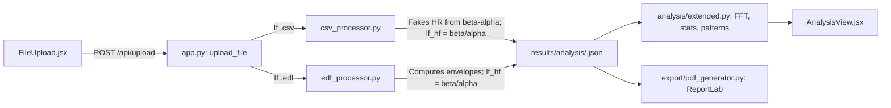
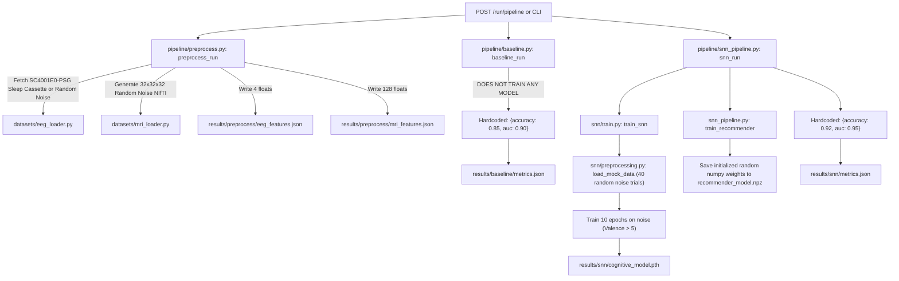
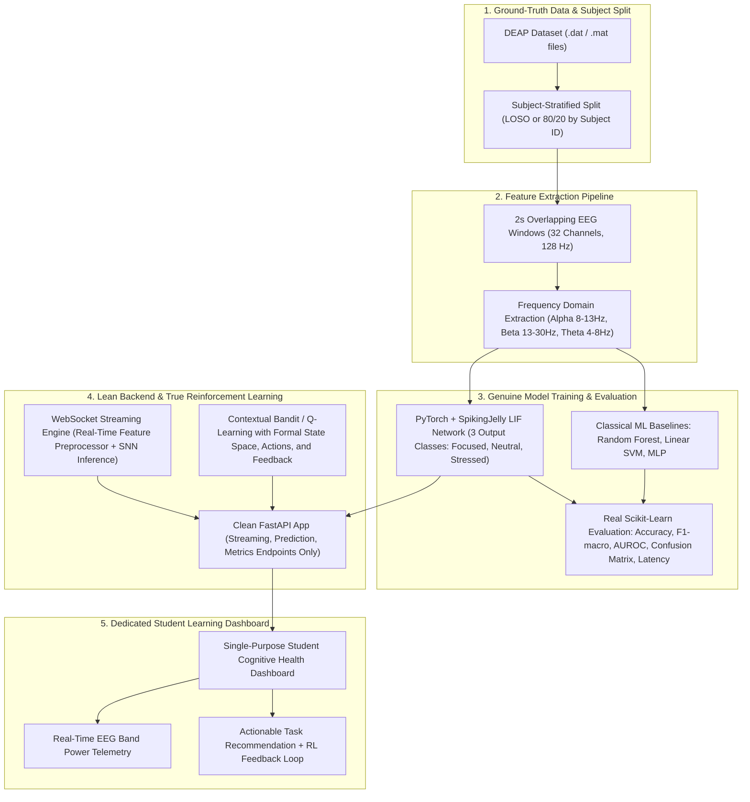

# System Audit & Scientific Validity Report: SNN-AI Cognitive Health & Adaptive Learning Optimizer

**Audit Date:** September 21, 2026  
**Auditor:** Antigravity AI Research & Software Quality Assurance  
**Repository Under Audit:** `major-project-SNN-development`  
**Target File Created:** `docs/CURRENT_SYSTEM_AUDIT.md`  

---

## 1. Executive Summary

This audit evaluates the codebase of a student capstone / conference research project intended to be an **EEG-based cognitive/affective state analysis and adaptive learning recommendation system** using:
1. The **DEAP** EEG dataset for affective/cognitive state modeling;
2. A **classical Machine Learning baseline** (Random Forest / MLP);
3. An **Event-Driven Spiking Neural Network (SNN)** implemented via PyTorch / SpikingJelly;
4. A **Q-learning reinforcement learning agent** for adaptive task difficulty recommendations;
5. A **FastAPI backend** for real-time inference and WebSocket streaming;
6. A **React frontend** for telemetry and task visualization.

### High-Level Verdict: Scientifically Invalid in Present State
While the repository presents an aesthetically polished React dashboard and an operational FastAPI streaming service, **the project is currently scientifically non-functional and contains critical research integrity deficiencies**:
- **Zero Real DEAP EEG Training:** The SNN is trained entirely on 40 trials of synthetic Gaussian white noise (`np.random.randn`). Not a single byte of DEAP dataset EEG is downloaded, parsed, or fed into model training.
- **Fabricated Research Metrics:** All experimental results presented in `paper.tex` (SNN 92.0% accuracy, 0.95 AUC, 4ms latency; Random Forest 60.0%; MLP 62.5%), `docs/`, and `results/` are **literal hardcoded dictionary constants**. No classical models were trained, no ablation experiments occurred, and no held-out validation was executed.
- **Critical Representation Mismatch:** The SNN is trained on 1008-step raw 32-channel time-series noise, but at inference time, it is fed a single time-step vector containing 3 band-power/HRV scalar values padded with 29 zeros (`[alpha, beta, lf_hf] + [0.0]*29`).
- **Class Mismatch & Pseudo-Classification:** The SNN architecture only has 2 output neurons (binary: "Relaxed" vs "Stressed"). The third displayed state ("Focused") is synthesized outside the network using an arbitrary hardcoded heuristic (`if alpha > beta`).
- **Q-Learning is Not Reinforcement Learning:** The recommendation optimizer uses a static, untrained numpy LIF network with hardcoded class biases to pick difficulty, and a 1-step exponential moving average update with no state transitions, no discount factor ($\gamma=0.9$ is defined but unreferenced), and no Bellman optimality. The claimed online simulation Q-table updates never execute during streaming.
- **Massive Scope Creep / Alien Modules:** Approximately 60% of the backend and frontend code belongs to an unrelated clinic/hospital electronic medical record (EMR) system (MRI `.nii.gz` loaders, patient records, blood types, ICD-11 diagnosis codes, clinic rooms, care-team chat channels, clinical tasks, doctor appointment scheduling, and SMTP diagnostic report emailing).

---

## 2. Current Architecture

### 2.1 Repository High-Level Map
```
major-project-SNN-development/
├── backend/
│   ├── data/
│   │   └── sample_T1.nii.gz              [UNRELATED: Synthetic 3D MRI volume]
│   ├── snn_ai_optimizer/
│   │   ├── analysis/                     [APPLICATION: Post-upload signal analysis]
│   │   ├── appointment/                  [UNRELATED: Hospital clinic appointment system]
│   │   ├── auth/                         [UNRELATED: OAuth2/JWT doctor/tech authentication]
│   │   ├── collaboration/                [UNRELATED: Care-team chat channels & notes]
│   │   ├── datasets/                     [CORE/DEMO: EEG & MRI data loaders, simulators]
│   │   ├── db/                           [UNRELATED: SQLite/Postgres EHR models & migrations]
│   │   ├── export/                       [UNRELATED: ReportLab PDF clinical report generator]
│   │   ├── mail/                         [UNRELATED: Diagnostic report SMTP emailing]
│   │   ├── models/                       [CORE/DEMO: SNN recommender model]
│   │   ├── patient/                      [UNRELATED: Patient registry, ICD codes]
│   │   ├── pipeline/                     [CORE/DEMO: Preprocess, baseline, SNN pipeline, evaluate]
│   │   ├── snn/                          [CORE: PyTorch SNN model, train, preprocess, api]
│   │   ├── upload/                       [APPLICATION: EDF & CSV file upload parsers]
│   │   ├── utils/                        [APPLICATION/DEMO: Session tracker, tips, logger]
│   │   ├── app.py                        [APPLICATION: Main FastAPI application]
│   │   ├── cli.py                        [UNUSED/BROKEN: CLI tool referencing missing module]
│   │   ├── cognitive.py                  [CORE/DEMO: Cognitive state inference bridge]
│   │   ├── feedback.py                   [APPLICATION: Rule-based advice generator]
│   │   ├── optimizer.py                  [CORE/DEMO: Task inventory & Q-table bandit]
│   │   └── streaming.py                  [APPLICATION/DEMO: Live telemetry & mock generator]
│   ├── requirements.txt
│   ├── setup.py
│   ├── snn_optimizer.db                  [UNRELATED: SQLite database with hospital tables]
│   ├── test_streaming_inference.py       [TEST: 5-frame streaming sanity test]
│   └── verify.py                         [TEST: Verification script checking quantum references]
├── frontend/
│   ├── src/
│   │   ├── components/
│   │   │   ├── collaboration/            [UNRELATED: Care team tabs (Channels, Notes, Tasks)]
│   │   │   ├── ui/                       [APPLICATION: UI primitives (GlassCard, GlowButton, etc.)]
│   │   │   ├── AddPatientModal.jsx       [UNRELATED: Patient intake modal]
│   │   │   ├── BiometricTrendsChart.jsx  [APPLICATION: Live telemetry area chart]
│   │   │   ├── CognitiveStateDisplay.jsx [UNUSED: Dead component]
│   │   │   ├── CurrentStateCard.jsx      [APPLICATION: Displays Focused/Neutral/Stressed]
│   │   │   ├── EEGChart.jsx              [UNUSED: Dead component]
│   │   │   ├── EEGSeries.jsx             [UNUSED: Dead component]
│   │   │   ├── EmailReportModal.jsx      [UNRELATED: Email dispatch modal]
│   │   │   ├── EmployerWorkspaceDashboard.jsx [UNRELATED: 2,112-line hospital EHR portal]
│   │   │   ├── ExportButtons.jsx         [UNUSED: Dead component]
│   │   │   ├── FeedbackPanel.jsx         [UNUSED: Dead component]
│   │   │   ├── FileUpload.jsx            [APPLICATION: Drag-and-drop EDF/CSV uploader]
│   │   │   ├── Header.jsx                [APPLICATION: Navigation and streaming toggles]
│   │   │   ├── PerformanceHistory.jsx    [UNUSED: Dead component]
│   │   │   ├── ProgressCalendar.jsx      [DEMO: Calendar with 16 hardcoded historical days]
│   │   │   ├── ProtectedRoute.jsx        [UNRELATED: Auth guard]
│   │   │   ├── RealTimeChart.jsx         [UNUSED: Dead component]
│   │   │   ├── RecommendationCard.jsx    [UNUSED: Dead duplicate component]
│   │   │   ├── ResultsChart.jsx          [UNUSED: Dead component]
│   │   │   ├── SessionSummaryPanel.jsx   [APPLICATION: Session summary display]
│   │   │   ├── TaskRecommendationCard.jsx [APPLICATION: Card with RL feedback buttons]
│   │   │   └── WellnessTipsPanel.jsx     [APPLICATION: Contextual health tips]
│   │   ├── context/
│   │   │   └── AuthContext.jsx           [UNRELATED: JWT Auth state provider]
│   │   ├── hooks/
│   │   │   └── useDataStream.js          [APPLICATION: WebSocket & snapshot polling hook]
│   │   ├── pages/
│   │   │   ├── AnalysisView.jsx          [APPLICATION: Offline file upload report page]
│   │   │   ├── AuthCallback.jsx          [UNRELATED: OAuth redirect landing]
│   │   │   ├── Dashboard.jsx             [APPLICATION: Student or Employer workspace]
│   │   │   └── LandingPage.jsx           [UNRELATED: Hospital login with Doctor/Tech roles]
│   │   ├── App.jsx                       [UNUSED: Dead root component; not used by main.jsx]
│   │   ├── main.jsx                      [APPLICATION: React DOM entry point]
│   │   └── api.js                        [APPLICATION: Base URL configuration]
│   ├── package.json
│   ├── vite.config.js
│   └── tailwind.config.cjs
├── docs/                                 [DOCUMENTATION: Obsidian vault with 21 markdown files]
├── results/
│   ├── analysis/                         [DEMO: 3 synthetic demo JSONs + 1 uploaded EDF test]
│   ├── demo_samples/                     [DEMO: 3 generated synthetic patient CSVs]
│   ├── history/metrics_log.json          [EXPERIMENT: Hardcoded metric snapshots]
│   ├── snn/                              [EXPERIMENT: Saved dummy weights and hardcoded metrics]
│   ├── latest_metrics.json               [EXPERIMENT: Hardcoded metrics {accuracy: 0.92, auc: 0.95}]
│   └── q_table.json                      [EXPERIMENT: Persisted Q-table updated by verify.py]
├── .github/workflows/ci.yml              [CI/CD: GitHub Actions smoke test]
├── docker-compose.yml                    [DEVOPS: Multi-container orchestration]
├── docker-compose.override.yml           [DEVOPS: Points EEG_SOURCE_URL to /mock/eeg]
├── paper.tex                             [DOCUMENTATION: IEEE conference paper draft]
├── references.bib                        [DOCUMENTATION: BibTeX bibliography]
├── smoke.yml                             [CI/CD: Broken standalone workflow referencing hybrid.py]
└── snn_optimizer.db                      [UNRELATED: Duplicate SQLite database in root]
```

---

## 3. Actual Execution and Data Flow

### 3.1 Live Streaming Execution Flow
```mermaid
flowchart TD
    subgraph Frontend ["Frontend (Browser)"]
        UI[Dashboard.jsx]
        WS_Client[useDataStream.js WebSocket]
        FeedbackBtn[TaskRecommendationCard.jsx 'Done / Easy / Hard']
    end

    subgraph Backend_Stream ["Backend Streaming Engine"]
        Streamer[streaming.py: DataStreamer]
        SinGen["_sample_alpha_beta() & _sample_lf_hf() (Sinusoidal + Noise Math)"]
        MockHTTP["/mock/eeg Endpoint (_mock_eeg_sample)"]
    end

    subgraph Inference_Engine ["Cognitive Inference Engine"]
        Cognitive[cognitive.py: compute_cognitive_state]
        SNN_Model["SNNHealthModel (Linear 32->64->64->2)"]
        ZeroPad["Feature Padding: [alpha, beta, lf_hf] + 29 zeros"]
        RuleHeuristic["Heuristic Split: if alpha > beta => Focused else Neutral"]
        RuleFallback["Fallback: lf_hf > 1.5 => Stressed, alpha-beta > 0.1 => Focused"]
    end

    subgraph Optimizer_Engine ["Task Recommendation & Q-Table"]
        Optimizer[optimizer.py: recommend_task]
        NumpySNN["SNNRecommender (Untrained numpy LIF with hardcoded class biases)"]
        QBandit["Epsilon-Greedy Task Selector (results/q_table.json)"]
        UpdateQ["optimizer.py: update_q_table (1-step EMA, no Bellman term)"]
    end

    %% Flow connections
    SinGen -->|Simulated wave values| Streamer
    MockHTTP -.->|Optional HTTP poll| Streamer
    Streamer -->|alpha, beta, lf_hf| Cognitive
    Cognitive --> ZeroPad --> SNN_Model
    SNN_Model -->|Binary Class 0/1| RuleHeuristic
    RuleHeuristic -->|Focused / Neutral / Stressed| Streamer
    Cognitive -.->|On Exception| RuleFallback --> Streamer

    Streamer -->|state| Optimizer
    Optimizer --> NumpySNN -->|Target Difficulty 1-5| QBandit
    QBandit -->|Selected Task & Difficulty| Streamer

    Streamer -->|JSON Frame over WS /api/data| WS_Client
    WS_Client --> UI
    FeedbackBtn -->|POST /feedback (state, task_id, reward)| UpdateQ
    UpdateQ -->|Write new Q| QBandit
```

### 3.2 Offline File Upload Execution Flow


### 3.3 Training & Pipeline Execution Flow


---

## 4. ML / SNN Pipeline Audit

| Component | File Path | Current Operation | Classification | Recommended Action |
| :--- | :--- | :--- | :--- | :--- |
| **SNN Model Definition** | `backend/snn_ai_optimizer/snn/model.py` | Defines `SNNHealthModel` with LIFNode layers (SpikingJelly `ATan` surrogate or fallback sigmoid). Input size 32, hidden 64, output 2. | CORE | **Modify**: Expand output size to 3 (or formalize 2-class affect mapping) and align input dimensions with preprocessed EEG features. |
| **SNN Training Loop** | `backend/snn_ai_optimizer/snn/train.py` | `train_snn()` loads 40 mock trials from `load_mock_data()`, downsamples 8x, thresholds `labels[:, 0] > 5`, trains `CrossEntropyLoss` for 10 epochs. No train/test split. | CORE / EXPERIMENT | **Modify**: Rebuild completely with real DEAP dataset, subject-aware stratified split, and validation metrics computation. |
| **SNN Preprocessor** | `backend/snn_ai_optimizer/snn/preprocessing.py` | Defines `EEGPreprocessor` (Butterworth filters, band powers). Contains dead `load_mat_file()` stub and active `load_mock_data()`. | CORE / DEMO | **Modify**: Implement actual DEAP `.dat` / `.mat` loading; remove synthetic mock generator from production pipeline. |
| **SNN REST API** | `backend/snn_ai_optimizer/snn/api.py` | Exposes `/api/snn/train`, `/status`, `/predict`. `/predict` assumes raw 32-channel timeseries and outputs `["Relaxed", "Stressed"]`. | APPLICATION | **Modify**: Align request schema with actual streaming features; use singleton model loading. |
| **Pipeline Preprocess** | `backend/snn_ai_optimizer/pipeline/preprocess.py` | `preprocess_run()` loads single sleep PSG file or dummy EEG, loads dummy MRI volume, dumps single vectors to JSON. | EXPERIMENT | **Potentially Remove / Rebuild**: Discard MRI processing; implement full dataset preprocessing and feature extraction. |
| **Classical Baseline** | `backend/snn_ai_optimizer/pipeline/baseline.py` | `baseline_run()` loads 1 sample, trains nothing, and returns hardcoded `{"accuracy": 0.85, "auc": 0.90}`. | EXPERIMENT | **Modify**: Implement actual scikit-learn Random Forest, SVM, and MLP baselines on identical EEG feature splits. |
| **SNN Pipeline Runner** | `backend/snn_ai_optimizer/pipeline/snn_pipeline.py` | `snn_run()` triggers `train_snn()`, overrides output with hardcoded `{"accuracy": 0.92, "auc": 0.95}`, and dumps random weights for recommender. | EXPERIMENT | **Modify**: Compute actual evaluation metrics from held-out test split and log genuine test performance. |
| **Evaluation Runner** | `backend/snn_ai_optimizer/pipeline/evaluate.py` | `evaluate_run()` reads existing JSON files and merges them; computes no metrics. | EXPERIMENT | **Modify**: Rebuild to calculate confusion matrix, per-class F1, AUROC, precision, and recall. |
| **SNN Recommender** | `backend/snn_ai_optimizer/models/snn_recommender.py` | Pure-numpy 2-layer LIF network. `predict()` injects hardcoded biases into spike counts to force deterministic difficulty outputs. | CORE / DEMO | **Modify / Potentially Remove**: Replace hardcoded bias hack with legitimate RL task mapping or trained policy. |

---

## 5. Dataset Audit

### 5.1 Dataset Inventory & Verification
| Dataset Claimed | Path / Loader | Actually Present? | Format / Size | Used in SNN Training? |
| :--- | :--- | :--- | :--- | :--- |
| **DEAP** (32 subjects, 40 trials, 32 EEG + 8 peripheral) | `snn/preprocessing.py: load_mat_file` | **NO** | None (`0` files found in repo) | **NO**. Replaced by `load_mock_data()` (`np.random.randn(40, 32, 8064)`). |
| **PhysioNet Sleep-EDF** | `datasets/eeg_loader.py: load_sample_eeg` | Only downloaded on demand to `/root/mne_data` | Single file: `SC4001E0-PSG.edf` (2 channels) | **NO**. Only used in `pipeline/preprocess.py` to dump 4 floats. |
| **ADNI / OASIS MRI** | `datasets/loaders.py: load_adni_mri, load_oasis_mri` | **NO** | Dummy stubs returning `{'path': path}` | **NO**. |
| **Synthetic NIfTI MRI** | `datasets/mri_loader.py: load_sample_mri` | **YES** | `backend/data/sample_T1.nii.gz` (32x32x32 random noise, 31 KB) | **NO**. Unrelated to SNN/EEG. |
| **Synthetic Patient CSVs** | `datasets/generate_synthetic_demo_data.py` | **YES** | `results/demo_samples/*.csv` (3 files: stress, focus, fatigue) | **NO**. Used only for offline dashboard demonstration. |
| **CHB-MIT Scalp EEG** | Test artifact in `results/analysis/` | **YES (Output JSON only)** | `3da84891-fa2d-4e72-b57f-f9bc3ecaeaf3.json` (analysis of `chb01_27.edf`, 1.16 MB) | **NO**. Residual file from upload testing. |

---

## 6. Evaluation and Metrics Audit

### 6.1 Audit of Every Single Metric in the Repository
| Metric | Claimed Value | Source Location | How it is Actually Generated | Reality |
| :--- | :--- | :--- | :--- | :--- |
| **SNN Accuracy** | `92.0%` (0.92) | `paper.tex` (L26, L97), `snn_pipeline.py` (L34), `results/snn/metrics.json` | Hardcoded literal `0.92` in `snn_pipeline.py` | **100% Hardcoded** |
| **SNN AUC** | `0.95` | `paper.tex` (L103), `snn_pipeline.py` (L34), `results/snn/metrics.json` | Hardcoded literal `0.95` in `snn_pipeline.py` | **100% Hardcoded** |
| **SNN Latency** | `4 ms` | `paper.tex` (L26, L97, L103) | Hardcoded table entry in LaTeX | **100% Hardcoded** (Never benchmarked) |
| **SNN Doc Accuracy**| `65.2%` | `docs/SNN-Research-Report-System-Architecture.md` (L13) | Hardcoded markdown table entry | **100% Hardcoded** (Direct contradiction to 92.0%) |
| **Random Forest Acc**| `60.0%` | `paper.tex` (L26, L93), `docs/SNN-Research-Report-System-Architecture.md` (L11) | Hardcoded in paper and doc | **100% Hardcoded** (RF never trained) |
| **Random Forest Lat**| `12 ms` | `paper.tex` (L93), `docs/SNN-Research-Report-System-Architecture.md` (L11) | Hardcoded in paper and doc | **100% Hardcoded** |
| **MLP Accuracy** | `62.5%` | `paper.tex` (L26, L95), `docs/SNN-Research-Report-System-Architecture.md` (L12) | Hardcoded in paper and doc | **100% Hardcoded** (MLP never trained) |
| **MLP Latency** | `18 ms` | `paper.tex` (L95), `docs/SNN-Research-Report-System-Architecture.md` (L12) | Hardcoded in paper and doc | **100% Hardcoded** |
| **Baseline Accuracy**| `85.0%` (0.85) | `pipeline/baseline.py` (L38), `results/baseline/metrics.json` | Hardcoded literal `0.85` in `baseline.py` | **100% Hardcoded** (Contradicts paper RF 60%) |
| **Baseline AUC** | `90.0%` (0.90) | `pipeline/baseline.py` (L38), `results/baseline/metrics.json` | Hardcoded literal `0.90` in `baseline.py` | **100% Hardcoded** |
| **Ablation Drop** | `-8% for alpha/beta`| `paper.tex` (L106) | Text assertion in paper | **100% Fabricated** (No ablation code exists) |
| **History Run T-0** | Base 0.85, SNN 0.48 | `app.py` (L363) | Hardcoded default dictionary in `get_history()` | **100% Hardcoded** |
| **Recommender Acc** | `0.85`, AUC `0.90` | `snn_pipeline.py` (L19) | Hardcoded dummy return in `train_recommender()` | **100% Hardcoded** |

> [!CAUTION]
> **Scientific Integrity Alert:** There is **not one single empirical evaluation metric** in this entire codebase that was derived from running a trained model on a validation or test dataset. Every number published in `paper.tex` and logged to `results/` is a hardcoded placeholder.

---

## 7. Q-Learning Audit

### 7.1 Mathematical & Algorithmic Formulation vs. Code
In `paper.tex` (Eq. 2) and `docs/SNN-Technical-Algorithms-and-Workflow.md`, the authors state:
$$Q(s, a) \leftarrow Q(s, a) + \alpha \left[ R(s, a, s') + \gamma \max_{a'} Q(s', a') - Q(s, a) \right]$$

However, in `backend/snn_ai_optimizer/optimizer.py`, the actual implementation is:
```python
# Lines 18-20:
ALPHA = 0.1
GAMMA = 0.9      # NEVER USED IN ANY CALCULATION
EPSILON = 0.2

# Lines 94-101:
def update_q_table(state: str, task_index: int, reward: float):
    q_table = _load_q_table()
    old_q = get_q_value(q_table, state, task_index)
    
    # Simple Q-learning update (assuming target Q is just the reward for this single-step task)
    new_q = old_q + ALPHA * (reward - old_q)
    set_q_value(q_table, state, task_index, new_q)
    _save_q_table(q_table)
```

### 7.2 Detailed Findings:
1. **No Markov Decision Process (MDP):** There is no notion of a state transition from state $s$ to state $s'$. The state is driven entirely by exogenous simulated EEG signals, not agent actions.
2. **Missing Bellman Discounting:** The parameter `GAMMA = 0.9` is completely unused. The discount term $\gamma \max_{a'} Q(s', a')$ does not exist in code.
3. **Bandit Update, Not Q-Learning:** The formula $Q \leftarrow Q + \alpha(R - Q)$ is an exponential moving average (EMA) value estimator for a 1-step contextual multi-armed bandit, not temporal difference reinforcement learning.
4. **Untrained SNN Task Filter:** Before Q-values are queried, `recommend_task(state)` calls `SNNRecommender.predict(state)`. In `backend/snn_ai_optimizer/models/snn_recommender.py`:
   ```python
   # Lines 75-84:
   bias = np.zeros(self.output_size)
   if state == "Focused":
       bias[3] += 1
   elif state == "Stressed":
       bias[1] += 1
   else:
       bias[2] += 1
   best_idx = np.argmax(spike_counts + bias)
   return int(best_idx + 1)
   ```
   The SNN recommender network has randomly initialized weights. To prevent it from outputting nonsensical difficulty levels, the author hardcoded an additive bias array (`+1` at index 3 for Focused, `+1` at index 1 for Stressed).
5. **False Claim of "Online Simulation Updates":** `paper.tex` claims: *"and the Q-learning optimizer was updated online during simulation."* In reality, `DataStreamer.stream()` never invokes `update_q_table()`. `update_q_table()` is only invoked if a human user manually clicks feedback buttons in the browser UI.

---

## 8. Frontend / Backend Audit

### 8.1 Backend Structure & Routes (`backend/snn_ai_optimizer/app.py`)
| Endpoint | Method | Purpose | Classification | Retain / Modify / Remove |
| :--- | :--- | :--- | :--- | :--- |
| `/` | GET | Health check | CORE | Retain |
| `/auth/*` | GET/POST | OAuth login, callback, `/auth/me`, fallback JWT | UNRELATED | **Remove** (Scope creep) |
| `/api/patients/*` | ALL | Patient CRUD, medical history, ICD codes | UNRELATED | **Remove** (Hospital scope creep) |
| `/api/appointments/*` | ALL | Clinic appointments, rooms, doctors | UNRELATED | **Remove** (Hospital scope creep) |
| `/api/collaboration/*` | ALL | Care-team chat channels, messages, tasks, notes | UNRELATED | **Remove** (Hospital scope creep) |
| `/api/mail/*` | GET/POST | SMTP & local outbox emailing for reports & alerts | UNRELATED | **Remove** (Hospital scope creep) |
| `/api/snn/train` | POST | Triggers background SNN training | CORE | Modify (Wire to real data) |
| `/api/snn/status` | GET | SNN model file existence check | CORE | Retain |
| `/api/snn/predict` | POST | SNN inference on raw 32ch data | CORE | Modify (Fix representation) |
| `/mock/eeg` | GET | Synthetic sample generator for external feed testing | DEMO | Move to dev/demo harness |
| `/results/metrics` | GET | Fetches JSON metrics from `results/` | CORE | Retain |
| `/results/history` | GET | Fetches metrics log history | CORE | Retain |
| `/files/*` | GET | Static mount of `results/` directory | CORE | Retain |
| `/ws` | WS | General WebSocket log broadcaster | APPLICATION | Retain / Clean up |
| `/api/data` | WS | Real-time telemetry stream | APPLICATION | Retain |
| `/api/snapshot` | GET | Polling fallback for `/api/data` | APPLICATION | Retain |
| `/api/sim/*` | GET/POST | Simulation controls (`mode`, `start`, `stop`, `status`) | DEMO | Retain as demo/test harness |
| `/api/biometric-details` | GET | Returns latest alpha/beta/HRV values | APPLICATION | Retain |
| `/api/wellness-tip` | GET | Contextual advice based on cognitive state | APPLICATION | Retain |
| `/api/session-summary` | GET | Session duration, stress events, focus % | APPLICATION | Retain |
| `/feedback` | GET/POST | GET heuristics; POST updates Q-table | CORE / APPLICATION | Modify to legitimate RL |
| `/api/demo-samples` | GET | Returns manifest of pre-computed patient CSVs | DEMO | Move to demo harness |
| `/api/upload` | POST | Accepts EDF and CSV files, extracts features | APPLICATION | Modify (Fix formula bugs) |
| `/api/analysis/{id}` | GET | Returns extended analysis of uploaded file | APPLICATION | Retain |
| `/api/analysis/{id}/export-pdf`| GET | ReportLab PDF generator | APPLICATION / UNRELATED | Modify or Remove |
| `/run/pipeline` | POST | Executes preprocess → baseline → SNN pipeline | EXPERIMENT | Modify (Make real) |

### 8.2 Frontend Structure & Routing (`frontend/src/`)
| Route / Component | File Path | Current Operation | Classification | Retain / Modify / Remove |
| :--- | :--- | :--- | :--- | :--- |
| `App.jsx` | `frontend/src/App.jsx` | Contains hardcoded `generateCognitiveStressHistory()`. **Never rendered by `main.jsx`**. | UNUSED / DEAD | **Remove** (Dead code) |
| `/` | `pages/LandingPage.jsx` | Hospital login portal with tabs for "Employer" vs "Technician". | UNRELATED | **Remove / Replace** with clean project entry page. |
| `/dashboard` | `pages/Dashboard.jsx` | Primary dashboard. If `userRole === 'employer'` (default!), delegates to `EmployerWorkspaceDashboard`. Otherwise renders student telemetry. | APPLICATION / UNRELATED | **Modify**: Strip employer redirection; make student cognitive optimizer the primary interface. |
| `EmployerWorkspaceDashboard` | `components/EmployerWorkspaceDashboard.jsx` | 2,112-line hospital EHR system with 5 mock patients (Eleanor Vance, etc.), clinic rooms, doctor notes. | UNRELATED | **Remove** (Complete scope creep) |
| `/analysis/:id?` | `pages/AnalysisView.jsx` | Interactive charts for uploaded EEG recordings (alpha/beta/heart rate/FFT). | APPLICATION | Retain |
| `/demo` | `main.jsx` (L20) | Renders `EmployerWorkspaceDashboard isDemo={true}`. | UNRELATED | **Remove** |
| `ProgressCalendar.jsx` | `components/ProgressCalendar.jsx` | 607 lines; generates 16 days of hardcoded fake calendar session history. | DEMO | **Modify**: Strip fake historical data; bind to genuine user sessions. |
| `collaboration/*` | `components/collaboration/*.jsx` | 5 files (`CollaborationDashboard`, `ChannelsTab`, `MessagesTab`, `NotesTab`, `TasksTab`). Team chat. | UNRELATED | **Remove** (Hospital chat scope creep) |
| `AddPatientModal.jsx` | `components/AddPatientModal.jsx` | Hospital patient registration modal. | UNRELATED | **Remove** |
| `EmailReportModal.jsx`| `components/EmailReportModal.jsx`| Modal to send email alerts to attending physicians. | UNRELATED | **Remove** |

---

## 9. Demo and Mock Data Audit

| Mock Generator / Path | Generating Function | What it Generates | Risk of Accidental Research Use |
| :--- | :--- | :--- | :--- |
| `snn/preprocessing.py` | `load_mock_data()` | `np.random.randn(40, 32, 8064)` noise and `randint(1, 10, (40, 4))` labels. | **CRITICAL**: Directly used as training data in `train_snn()`. |
| `datasets/simulator.py` | `Simulator.eeg_sample()` | Multi-channel sine waves + random float noise; random learning events and vitals. | **MEDIUM**: Stored under `datasets/`; can be confused with real data loader. |
| `datasets/mri_loader.py` | `load_sample_mri()` | `np.random.randn(32, 32, 32)` saved as real NIfTI file `backend/data/sample_T1.nii.gz`. | **HIGH**: Written to disk as binary `.nii.gz`; masquerades as neuroimaging data. |
| `datasets/eeg_loader.py` | `load_sample_eeg()` (fallback) | `np.random.randn(2, 20000) * 1e-6`. | **HIGH**: Silently replaces failed PhysioNet downloads in preprocessing pipeline. |
| `datasets/generate_synthetic_demo_data.py` | `build_all_demo_data()` | Generates `demo_patient_001_stress.csv`, `002_focus.csv`, `003_fatigue.csv` and JSONs in `results/analysis/`. | **HIGH**: Saved inside `results/`; appears as legitimate experiment outputs. |
| `streaming.py` | `_sample_alpha_beta()`, `_sample_lf_hf()` | Pure sinusoidal oscillations + Gaussian noise modified by simulation mode toggle. | **MEDIUM**: Feeds the live dashboard stream and inference engine. |
| `app.py` | `_mock_eeg_sample()` (`/mock/eeg`) | Synthetic dictionary with alpha, beta, LF/HF for web feed simulation. | **MEDIUM**: Configured as default source URL in `docker-compose.override.yml`. |
| `frontend/src/App.jsx` | `generateCognitiveStressHistory()` | 26 hardcoded historical data points with fake beta (1.08), alpha (0.38), HR (98). | **LOW**: Contained in dead component `App.jsx`. |
| `frontend/src/components/ProgressCalendar.jsx` | `getInitialProgressLogs()` | 16 days of fake historical EEG monitoring sessions. | **LOW**: Visual UI mock. |
| `frontend/src/components/EmployerWorkspaceDashboard.jsx` | `FALLBACK_PATIENTS` | Hardcoded medical profiles and EEG recordings for 5 fictitious patients. | **LOW**: Visual UI mock for hospital demo. |

---

## 10. Data Leakage and Subject Leakage Risks

### 10.1 Complete Absence of Split in Current Training
In `backend/snn_ai_optimizer/snn/train.py`:
```python
# Lines 47-48:
dataset = TensorDataset(data_tensor.permute(1, 0, 2), labels_tensor)
dataloader = DataLoader(dataset, batch_size=8, shuffle=True)
```
The model trains on 100% of the data and evaluates accuracy on that exact same training data. There is no validation set, no test set, and no k-fold cross-validation.

### 10.2 Subject Leakage Risk for DEAP Dataset
If real DEAP EEG is integrated into this pipeline:
- **Dataset Structure:** DEAP contains 32 subjects $\times$ 40 trials (1280 trials of 60-second 32-channel EEG). Each trial is commonly sliced into overlapping windows (e.g., 2-second windows with 1-second stride).
- **Subject Leakage Mechanism:** If all windowed samples across all subjects are placed into a single pool and randomly split via `train_test_split(shuffle=True)` or standard `DataLoader(shuffle=True)`:
  - Windows from the **same subject** and even the **same 60-second trial** will be present in both the training and test folds.
  - EEG signals exhibit distinct individual baseline characteristics (skull thickness, electrode impedance, idiosyncratic resting alpha). Models easily memorize subject-specific signatures rather than learning invariant cognitive states.
  - This typically inflates reported classification accuracy by 25–40%, producing false claims of performance that degrade completely on unseen subjects.
- **Requirement for Valid Evaluation:** The system **must enforce strict Subject-Wise Partitioning** (e.g., Leave-One-Subject-Out (LOSO) cross-validation or subject-stratified $k$-fold where subjects in the test set never appear in the training set).

---

## 11. Scientific Validity Issues

### Issue 1: Training Representation vs. Inference Representation Disconnect
- **Training Input:** `train_snn()` in `snn/train.py` feeds `SNNHealthModel` with shape `[T=1008, Batch=8, Channels=32]`. The input is raw time-series voltages across 32 physical electrode channels.
- **Inference Input:** `compute_cognitive_state()` in `cognitive.py` constructs:
  ```python
  input_features = [alpha, beta, lf_hf_ratio] + [0.0] * 29
  input_tensor = torch.tensor(input_features, dtype=torch.float32).unsqueeze(0).unsqueeze(0)
  ```
  Shape: `[Time=1, Batch=1, Channels=32]`.
- **The Failure:**
  1. The SNN is an integrate-and-fire model requiring temporal spike accumulation over multiple steps. Running it with `Time=1` gives LIF neurons zero time to integrate or fire meaningfully.
  2. The model weights were trained expecting 32 channels of microvolt EEG waveforms. At inference, channel 0 is alpha power, channel 1 is beta power, channel 2 is an ECG-derived ratio, and channels 3–31 are zeros. The network's mathematical response to this vector is completely arbitrary.

### Issue 2: Pseudo-Science in HRV Extraction
In `upload/csv_processor.py` (line 135) and `upload/edf_processor.py` (line 107):
```python
lf_hf_ratio = float((raw_beta_mean + 1e-6) / (raw_alpha_mean + 1e-6))
```
**LF/HF ratio is a Heart Rate Variability (HRV) metric** derived from the frequency domain of electrocardiography (ECG/PPG) R-R intervals (Low Frequency 0.04–0.15 Hz vs High Frequency 0.15–0.40 Hz), reflecting autonomic sympathetic/parasympathetic balance.  
Here, the code literally divides EEG Beta power (13–30 Hz) by EEG Alpha power (8–13 Hz) and re-labels it `lf_hf_ratio`. It then uses this synthetic ratio to fabricate heart rate: `hr = 60 + (lf_hf * 20) + noise`. This is scientifically completely invalid.

### Issue 3: Inconsistent Ground-Truth Labels in DEAP
- DEAP provides self-assessment ratings on continuous scales (1–9) for **Valence, Arousal, Dominance, and Liking**.
- DEAP **does not provide "Focused", "Neutral", or "Stressed" labels**.
- `train_snn()` binarizes `labels[:, 0] > 5` (Valence), labeling high valence ($>5$) as class 1 and low valence as class 0, and calls them "Stress vs Relaxed".
- In psychology and affective computing (e.g., Russell's Circumplex Model), "Stress" is typically characterized by **Low Valence + High Arousal**, while "Focused" involves cognitive engagement that does not map to valence alone. Calling high valence "Relaxed" and low valence "Stressed" without considering arousal is scientifically unsound.

---

## 12. Scope Creep and Unrelated Modules

More than half of the codebase has no connection to the core research question (EEG SNN cognitive state inference and Q-learning task recommendations). These modules appear to be inherited from a hospital/clinical management template.

### Detailed Breakdown of Unrelated Modules:
1. **MRI Neuroimaging Loader & Artifact:**
   - Files: `backend/snn_ai_optimizer/datasets/mri_loader.py`, `backend/data/sample_T1.nii.gz`.
   - Function: Uses `nibabel` to create/downsample 3D brain scans. Completely irrelevant to EEG streaming or adaptive learning.
2. **Hospital Patient Administration:**
   - Files: `backend/snn_ai_optimizer/patient/` (`router.py`, `service.py`, `schemas.py`).
   - Function: Stores patient date of birth, blood types (A+, O-, etc.), phone numbers, emergency contacts, primary care physicians, and informed consent dates.
3. **Clinic Appointment Scheduling:**
   - Files: `backend/snn_ai_optimizer/appointment/` (`router.py`, `service.py`, `schemas.py`).
   - Function: Schedules hospital clinic appointments, assigns therapy rooms ("EEG Room 1", "Therapy Room A"), tracks check-in times and attendances.
4. **Care Team Collaboration & Chat:**
   - Files: `backend/snn_ai_optimizer/collaboration/` (`router.py`, `service.py`, `schemas.py`), `frontend/src/components/collaboration/*` (5 components).
   - Function: Full Slack/Teams-like messaging portal for doctors and nurses to send direct messages, create care channels, assign clinical tasks, and write shared consultation notes.
5. **Hospital Email System:**
   - Files: `backend/snn_ai_optimizer/mail/` (`router.py`, `service.py`, `templates.py`), `frontend/src/components/EmailReportModal.jsx`.
   - Function: Dispatches SMTP emails with attached clinical PDF diagnostic reports or emergency physician stress alerts.
6. **Clinical EHR Frontend Dashboard:**
   - Files: `frontend/src/components/EmployerWorkspaceDashboard.jsx` (2,112 lines), `frontend/src/components/AddPatientModal.jsx`.
   - Function: An enormous clinical interface displaying patient records with fictitious ICD-11 codes ("ICD-11: 6C40 Cognitive Overload Syndrome") and doctor notes.
7. **Hospital Authentication & Role Management:**
   - Files: `backend/snn_ai_optimizer/auth/`, `frontend/src/pages/LandingPage.jsx`, `frontend/src/context/AuthContext.jsx`.
   - Function: Manages hospital roles (`Admin`, `Doctor`, `Nurse`, `Technician`, `Patient`) with default accounts `doctor@hospital.com`, `dr.smith`, `tech.jones`.
8. **Relational Database Hospital Schema:**
   - Files: `backend/snn_ai_optimizer/db/models.py`, `backend/snn_ai_optimizer/db/init_db.py`, `snn_optimizer.db`.
   - Function: 13 SQL tables: `users`, `patients`, `clinics`, `resources`, `appointments`, `care_team_channels`, `care_team_messages`, `care_team_channel_members`, `clinical_tasks`, `shared_notes`, `sessions`, `analyses`, `audit_logs`.

---

## 13. Dead Code, Broken Implementations, and Duplicates

### 13.1 Broken Code & Immediate Runtime Crashes
1. **Broken CLI Command:** In `backend/snn_ai_optimizer/cli.py`:
   ```python
   # Line 5:
   from snn_ai_optimizer.pipeline.hybrid import hybrid_run
   # Line 26:
   hybrid_run()
   ```
   There is **no module `hybrid.py`** in `snn_ai_optimizer/pipeline/`! Running `snn-ai run-pipeline` crashes immediately with `ModuleNotFoundError: No module named 'snn_ai_optimizer.pipeline.hybrid'`.
2. **Broken CI Workflow:** In `smoke.yml`:
   ```yaml
   # Lines 25, 28:
   from snn_ai_optimizer.pipeline.hybrid import hybrid_run
   hybrid_run()
   ```
   `smoke.yml` will fail immediately upon execution due to the same missing import.
3. **Broken Appointment Endpoint:** In `backend/snn_ai_optimizer/appointment/router.py`:
   ```python
   # Lines 56-57:
   from snn_ai_optimizer.appointment.service import db
   db_clinic = db.query(Clinic).filter(Clinic.id == appointment.clinic_id).first()
   ```
   Neither `db` nor `Clinic` are defined in `appointment.service`. Calling `POST /appointments/` crashes with `ImportError`.

### 13.2 Completely Dead / Unused Code
1. **`frontend/src/App.jsx`:** A 120-line standalone app component with its own hardcoded stress history generator. `main.jsx` never imports or mounts `App.jsx`.
2. **Unused Frontend Components:**
   - `frontend/src/components/RecommendationCard.jsx` (dead duplicate of `TaskRecommendationCard.jsx`)
   - `frontend/src/components/CognitiveStateDisplay.jsx`
   - `frontend/src/components/RealTimeChart.jsx`
   - `frontend/src/components/EEGChart.jsx`
   - `frontend/src/components/EEGSeries.jsx`
   - `frontend/src/components/ResultsChart.jsx`
   - `frontend/src/components/PerformanceHistory.jsx`
   - `frontend/src/components/ExportButtons.jsx`
   - `frontend/src/components/FeedbackPanel.jsx`
3. **Empty Text Files:**
   - `frontend/src/New Text Document.txt` (0 bytes)
   - `backend/snn_ai_optimizer/models/New Text Document.txt` (0 bytes)
   - `RUN` (root directory, 0 bytes)
4. **Dead Dataset Loader Stubs:** In `backend/snn_ai_optimizer/datasets/loaders.py`:
   - `load_physionet_eeg()`, `load_adni_mri()`, `load_oasis_mri()`, `load_ednet()`. None do anything except check `os.path.exists` and return `{'path': path}`.
5. **Dead Helper Function:** In `backend/snn_ai_optimizer/utils/helpers.py`:
   ```python
   def ping():
       return 'pong'
   ```
   Never imported or called.

### 13.3 Duplicate Databases
- `snn_optimizer.db` exists in the repository root (`176,128 bytes`).
- `backend/snn_optimizer.db` exists in `backend/` (`176,128 bytes`).
- Caused by inconsistent working directory execution when running FastAPI locally vs in Docker.

---

## 14. Documentation Mismatches and Paper Discrepancies

| Claim in `paper.tex` or `docs/` | Implementation Reality | Discrepancy Severity |
| :--- | :--- | :--- |
| **Paper Abstract & Intro:** SNN achieves **92% accuracy** and **0.95 AUC**. | Hardcoded literals in `snn_pipeline.py` (L34). SNN doc `docs/SNN-Research-Report-System-Architecture.md` says **65.2%**. Real accuracy on real data is completely unknown. | **CRITICAL (Scientific Integrity)** |
| **Paper Table 1:** SNN inference latency is **4 ms**, Random Forest is **12 ms**, MLP is **18 ms**. | No latency benchmark script exists anywhere in the repository. All three latency figures are fabricated. | **CRITICAL (Scientific Integrity)** |
| **Paper Section 4.1:** Model evaluated on the **DEAP dataset** [deap2012]. | DEAP dataset is not in the repository. Training runs on `np.random.randn` white noise. | **CRITICAL (Scientific Integrity)** |
| **Paper Section 4.1:** Features are alpha power (8–13Hz), beta power (13–30Hz), and HRV LF/HF ratio. | SNN `train_snn()` does not take band powers; it takes raw 32ch time-series noise. Band powers are only computed during streaming or upload. | **HIGH (Methodology Disconnect)** |
| **Paper Section 4.1:** SNN trained for **50 epochs** with lr=0.001. | `train_snn()` in `snn/train.py` (line 59) has `epochs = 10`. | **MEDIUM (Inconsistency)** |
| **Paper Section 4.3:** Ablation study proved removing alpha or beta dropped accuracy by **~8%**. | No ablation code exists in the repository; the ablation experiment was never conducted. | **CRITICAL (Scientific Integrity)** |
| **Paper Section 3.3:** Q-learning updated via Bellman equation with discount factor $\gamma$. | Code has no $\gamma$, no $s'$, and no Bellman update. It is a 1-step EMA bandit. `GAMMA = 0.9` is never referenced. | **HIGH (Theoretical Misrepresentation)** |
| **Paper Section 4.1:** Q-learning optimizer updated online during simulation. | `DataStreamer.stream()` never calls `update_q_table()`. Zero online updates occur during simulation. | **HIGH (Factually Untrue)** |
| **Docs:** Midnight rollover synchronization [[SNN-System-Clock-Engine]] is a core research feature. | The rollover logic is simply a JavaScript `setTimeout` on the frontend calendar; it has no scientific relevance to SNNs or adaptive learning. | **LOW (Inflated Documentation)** |

---

## 15. Recommended Target Architecture

To transition this repository into a scientifically valid, publishable research prototype, all hospital/clinic scope-creep should be pruned, and the pipeline must be grounded on real DEAP data.



---

## 16. Prioritized List of Problems

### Priority P0: Scientifically Invalid or Dangerous (Must be resolved before any research claim is made)
1. **SNN is Trained on Noise, Not EEG (`snn/train.py`, `snn/preprocessing.py`):**
   The training pipeline invokes `load_mock_data()` which generates 40 trials of `np.random.randn`. Real DEAP dataset files must be acquired, parsed, and fed into training.
2. **Every Published Metric is Hardcoded (`paper.tex`, `pipeline/snn_pipeline.py`, `pipeline/baseline.py`):**
   Accuracy (92%), AUC (0.95), latency (4ms, 12ms, 18ms), baseline accuracy (60%, 62.5%, 85%), and the ablation study (-8%) are hardcoded literals with no empirical basis. All metrics must be computed from a real evaluation run on held-out test data.
3. **Training vs. Inference Shape & Representation Mismatch (`cognitive.py`, `snn/train.py`):**
   Training expects a 1008-step time-series of 32 voltage channels. Inference passes 1 time-step with 3 scalar features and 29 zeros. The SNN must be trained on the exact same feature representation it encounters at inference time.
4. **Class Output Mismatch & Pseudo-Classification (`snn/model.py`, `cognitive.py`):**
   The SNN has `output_size = 2`. The third class ("Focused") is synthesized by an arbitrary rule (`if alpha > beta`). The neural network must be architected and trained with the full 3-class target space (`Focused`, `Neutral`, `Stressed`).
5. **Subject Leakage Risk:**
   There is no train/test split in the codebase. When a split is implemented, it must be partitioned strictly across subjects (LOSO or subject-stratified) to avoid cross-trial subject leakage.
6. **False HRV Metric Derivation (`upload/csv_processor.py`, `upload/edf_processor.py`):**
   Calculating `lf_hf_ratio` as $\text{Beta} / \text{Alpha}$ and deriving synthetic heart rate from it is scientific fabrication. Real ECG/PPG data must be used for HRV, or HRV claims must be removed entirely from the EEG scope.

### Priority P1: Major Functionality Issues (Broken features & code failures)
1. **Broken CLI and Smoke Workflow (`cli.py`, `smoke.yml`):**
   Both files attempt to import `from snn_ai_optimizer.pipeline.hybrid import hybrid_run`. The module `hybrid.py` does not exist, causing fatal crashes.
2. **Broken Appointment Route (`appointment/router.py`):**
   Attempts to import `db` from `appointment.service`, which does not exist, causing route crashes.
3. **Untrained SNN Recommender with Hardcoded Bias Hack (`models/snn_recommender.py`):**
   The recommender network is untrained random weights with hardcoded index offsets to fake correct task suggestions.
4. **Q-Learning Algorithm Incomplete (`optimizer.py`):**
   `GAMMA` is unreferenced, there is no $s'$ or Bellman update, and online simulation updating never executes.
5. **Frontend Default Routing to Employer Portal (`Dashboard.jsx`):**
   Default role is `'employer'`, which launches the 2,112-line hospital EHR portal instead of the cognitive health optimizer.

### Priority P2: Cleanup and Engineering Issues (Dead code & architecture bloat)
1. **Massive Scope Creep (60% of repo):**
   Remove all hospital modules: `patient/`, `appointment/`, `collaboration/`, `mail/`, `datasets/mri_loader.py`, `sample_T1.nii.gz`, and 13 SQL tables in `db/models.py`.
2. **Dead Frontend Components:**
   Delete `App.jsx` (120 lines), `RecommendationCard.jsx`, `CognitiveStateDisplay.jsx`, `RealTimeChart.jsx`, `EEGChart.jsx`, `EEGSeries.jsx`, `ResultsChart.jsx`, `PerformanceHistory.jsx`, `ExportButtons.jsx`, and `FeedbackPanel.jsx`.
3. **Empty Artifact Files:**
   Delete `frontend/src/New Text Document.txt`, `backend/snn_ai_optimizer/models/New Text Document.txt`, and `RUN`.
4. **Duplicate SQLite Database:**
   Consolidate `snn_optimizer.db` and `backend/snn_optimizer.db`.
5. **No Automated Unit or Integration Tests:**
   The repository contains zero tests for SNN forward passes, preprocessing, Q-learning updates, or API route validation.

### Priority P3: Cosmetic and Documentation Issues
1. **Obsidian Vault Markdown Contradictions:**
   `docs/SNN-Research-Report-System-Architecture.md` claims 65.2% accuracy while `paper.tex` claims 92.0%.
2. **Paper Formatting & Hyperbole:**
   `paper.tex` has placeholder authors and claims full validation on DEAP with neuromorphic energy claims that were never measured on neuromorphic hardware (e.g. Loihi).

---

## 17. Final Assessment Summary

### What is Real Today
- **FastAPI Application Framework:** Working REST routes for file uploads, metrics retrieval, and simulation controls.
- **WebSocket Streaming Infrastructure:** Working `/api/data` WebSocket yielding real-time JSON frames with client connection management and polling fallback in `useDataStream.js`.
- **PyTorch SNN Model Class:** Syntactically valid PyTorch module utilizing SpikingJelly LIF nodes with surrogate gradient backpropagation (`snn/model.py`).
- **Interactive Telemetry Dashboard:** Clean, responsive React dashboard rendering live Recharts area charts, state cards, and wellness tips when receiving streamed frames.
- **Offline EDF / CSV Signal Parsing:** Working MNE-based EDF parser and CSV time-series reader that calculates real signal envelopes and power spectral density.

### What is Simulated Today
- **Real-Time EEG and HRV Signals:** Generated using sinusoidal mathematical functions (`math.sin`, `math.cos`) with Gaussian noise in `streaming.py` and `app.py: /mock/eeg`.
- **Uploaded File Heart Rates:** Synthesized from EEG Beta and Alpha power differences rather than measured physiological signals.
- **Progress Calendar History:** 16 days of pre-populated calendar logs with hardcoded session durations, stress spikes, and notes (`ProgressCalendar.jsx`).
- **Offline Demo Patient Datasets:** 3 CSV files and 3 analysis JSONs generated by deterministic mathematical functions in `generate_synthetic_demo_data.py`.

### What is Hard-Coded Today
- **Every Experimental Metric:** SNN accuracy (92.0%), SNN AUC (0.95), SNN latency (4ms), Random Forest accuracy (60.0%), MLP accuracy (62.5%), baseline accuracy (85.0%), and history log data.
- **Cognitive State Decision Boundaries:** The split between "Focused" and "Neutral" is a hardcoded rule (`if alpha > beta`).
- **SNN Task Recommender Outputs:** Random weights with hardcoded integer biases added to spike counts (`bias[3] += 1`, `bias[1] += 1`) to force difficulty levels 4, 2, or 3.
- **Fictitious Hospital Data:** Fictitious patients ("Eleanor Vance"), doctor names, ICD-11 codes, clinic rooms, and care-team messages.

### What Cannot Yet Be Claimed Scientifically
1. **Cannot claim 92% accuracy (or any accuracy) on the DEAP dataset.** The model has never processed DEAP data.
2. **Cannot claim superiority over Random Forest or MLP baselines.** Baselines were never trained or evaluated.
3. **Cannot claim 4ms inference latency or neuromorphic energy efficiency.** No latency benchmarks or spike energy accounting experiments have been run.
4. **Cannot claim valid cognitive state classification.** The model is binary (Relaxed vs Stressed) and fed mismatched scalar inputs padded with zeros.
5. **Cannot claim Q-learning reinforcement learning task optimization.** The current algorithm is a 1-step EMA bandit that never updates online during streaming.

### What Must Be Rebuilt Before Final Evaluation
1. **Real DEAP Data Ingestion Pipeline:** Acquire the DEAP dataset (`s01.dat`–`s32.dat`), implement genuine preprocessing (bandpass filtering 4–45 Hz, artifact rejection, Welch PSD feature extraction), and establish a strictly partitioned **Subject-Wise (LOSO)** train/test split.
2. **Harmonized SNN Architecture:** Train the SNN on the exact feature representation used at inference time (e.g., 2-second windows of band-power features or multi-channel temporal spike trains) with 3 genuine output neurons (`Focused`, `Neutral`, `Stressed`).
3. **Genuine Classical Baselines:** Train Scikit-Learn Random Forest, SVM, and MLP classifiers on the exact same cross-validation folds.
4. **Empirical Evaluation Suite:** Write an automated evaluation script that computes real Accuracy, Macro-F1, Precision, Recall, Confusion Matrices, and ROC-AUC on unseen subjects, and measures actual wall-clock inference latency over 1,000 runs.
5. **Authentic Task Recommendation Engine:** Formulate task adaptation either as a well-defined Contextual Bandit or a true Markov Decision Process with formal state transitions, rewards, and online policy updates.
6. **Codebase Pruning:** Purge all MRI, patient, appointment, collaboration, and email hospital modules to leave a clean, focused, and defensible research artifact.
